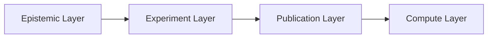

# Base76 Research Lab — Home

Architectural AI research focused on epistemic reliability.

---

## Mission

Base76 Research Lab develops reliable AI architectures that are uncertainty-aware, testable, and scientifically grounded.

---

## Architecture

---

## Repositories

### Core Technology
- **CognOS** — Closed-loop epistemic architecture framework
	https://github.com/base76-research-lab/cognos

### Research
- **Papers** — Publications and preprints
	https://github.com/base76-research-lab/Papers
- **Experiments** — Experimental results and datasets
	https://github.com/base76-research-lab/Experiments

### Research Notes
- **Thinking Out Loud** — Ideas, hypotheses, and development logs
	https://github.com/base76-research-lab/Thinking-Out-Loud

---

## Publications

Publication artifacts and citation metadata are maintained in the Papers repository.

---

## Compute Vision

Move from reproducible CPU/Colab runs to structured GPU-backed reliability benchmarking.

---

## Contact

Open an issue in the relevant repository for collaboration, replication requests, or partnership discussion.
